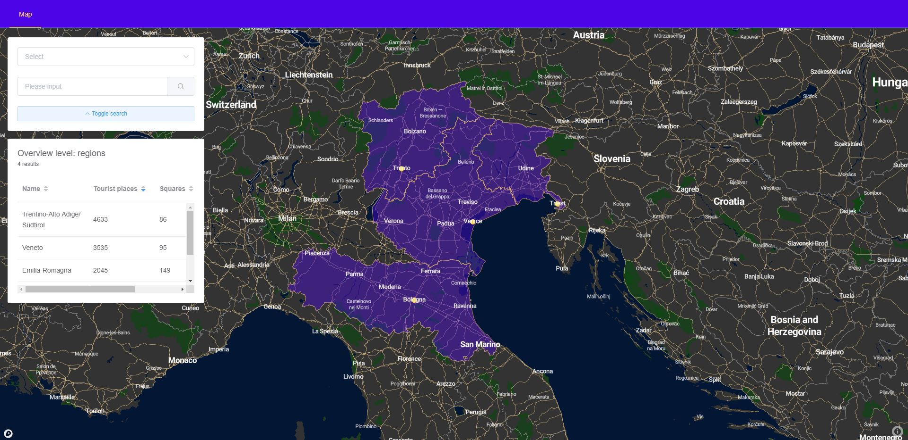
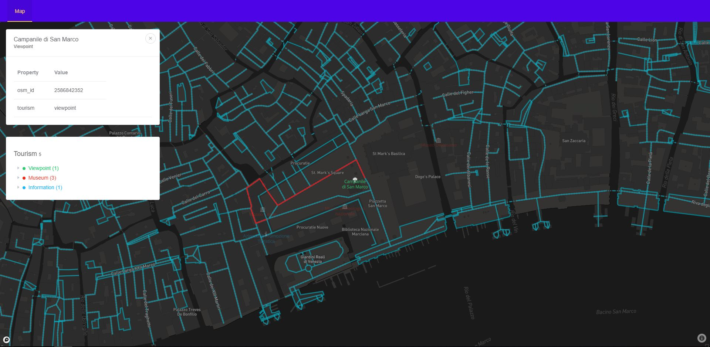
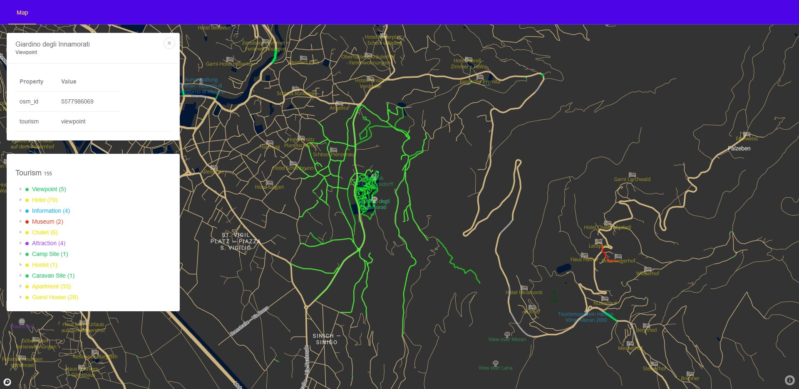
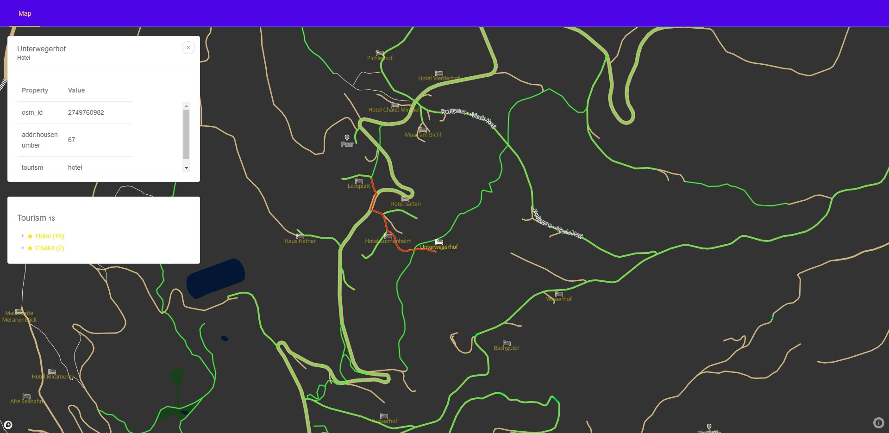

# Overview

This application helps tourists navigate in Italy (see the [API documentation](api.md) doc for query examples):
- display overview of administrative regions in Italy with number of points of interest, number of squares and administrative capital
- search tourist points by name
- display tourist points in the viewed area
- filter tourist points by type
- display roads in a radius around a point
- get directions between two points

This is it in action:

The application has 2 separate parts, the client which is a [frontend web application](#frontend) using Vue.js and mapbox-gl and the Node.js + Koa [backend application](#backend) using Postgres + PostGIS to query data. The frontend application communicates with backend using a REST API.

# Frontend

The frontend application is a `Vue.js + nuxt` app, which displays a `mapbox.js` widget. It provieds two view modes: overview and detail. The overview mode is a high-level (low zoom) view that displays region outlines at various levels with summary information for the regions being displayed. The detail level (high zoom) displays points of interest (from tourist perspective) and squares in the viewed area. Different types of points are displayed using different colors and icons to make navigation easier. In the detail view an item can be selected to get more information about it. Selected item can also be used to get directions to another nearby point of interest (if available).

All relevant frontend code is in the `src/client` folder. The most important file is then located in `pages/index.vue`.

# Backend

The backend application is written in JavaScript using `Node.js + Koa`. The server provides a simple API for the client to query data in the database. All relevant PG queries are located in `src/server/routes`.

## Data

The dataset used in this project comes from a pre-existing export of data from Open Street Maps (due to size limits imposed by the OSM exporter). I downloaded an extent north-eastern Italy (~62,310 km2 according to Wikipedia) and imported it using the `osm2pgsql`. 

File: `nord-est-latest.osm.pbf` (~450MB)

Source: [https://download.geofabrik.de/europe/italy/nord-est.html](https://download.geofabrik.de/europe/italy/nord-est.html)

* `planet_osm_point`: 2 940 764 rows
* `planet_osm_polygon`: 5 054 833 rows
* `planet_osm_line`: 1 357 901 rows

The resulting database has been further modified by introducting 2 new columns into the `planet_osm_polygon` table. Notes on how these columns can be seeded and maintined can be found in the more extensive [db documentation](database.md). The columns in question are:

* `squares_count_cache` - number of squares in the area (polygons, place=square)
* `tourist_places_count_cache` - number of tourist locations in the area (points, tourism != null)

The data was also additionally imported using the `osm2po` tool which creates a network of vertices for use in conjunction with the `pgRouting` extension. Following tables have been created (prefix=`pgr_italy`):

* `pgr_italy_2po_4pgr`: ~ 1 111 072 rows
* `pgr_italy_2po_vertex`: ~ 905 308 rows

The vertices table `pgr_italy_2po_vertex` has been modified by the addition of a geographical column `geog_vertex` for searching verticies based on distance in meters.

### Indices 
Several indices have been created on the imported data. Some of them are partial and queries for their creation can be found in the [db documentation](database.md). One of the indices requires the `btree_gist` extension as it combines string and geometrical data.

* `planet_osm_polygon` - `planet_osm_polygon_admin_way_index` - partial geometrical index over polygons that represent administrative areas
* `planet_osm_polygon` -  `planet_osm_polygon_place_index` - multiindex over name and place for searching
* `planet_osm_point` - `planet_osm_point_capitals_way_index` - partial gist index over points that represent administrative region capitals
* `planet_osm_point` - `planet_osm_point_tourism_way_index` - gist index on the `tourism` column and the geometry for finding tourist spots (require `btree_gist` extension)
* `planet_osm_point` - `planet_osm_point_id_index` - btree index on osm_id
* `pgr_italy_2po_vertex` - `vertex_geog_index` - gist index on a custom geographical column `geog_way` for finding vertices closest to points 
 

## API and queries

See the [API documentation](api.md) for query examples.