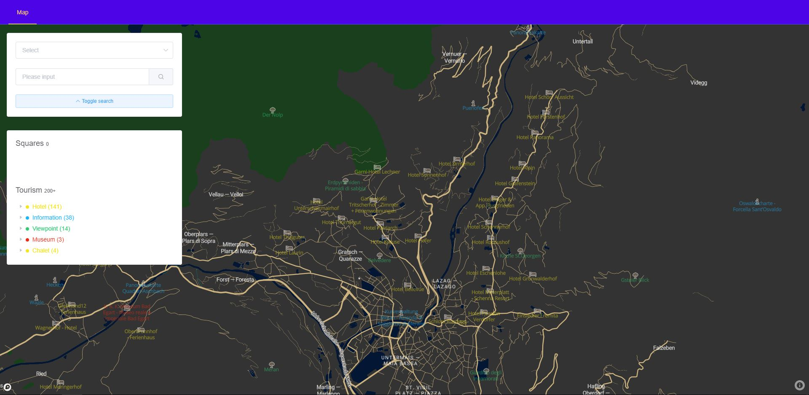

# Overview

This application helps tourists navigate in Italy:
- display overview of administrative regions in Italy with number of points of interest and squares
- search tourist points by name
- filter tourist points by type
- get directions between two points

This is it in action:





The application has 2 separate parts, the client which is a [frontend web application](#frontend) using Vue.js and mapbox-gl and the Node.js + Koa [backend application](#backend) using Postgres + PostGIS to query data. The frontend application communicates with backend using a [REST API](#api).


# Frontend

The frontend application is a Vue.js app, which shows a mapbox.js widget. It provieds two view modes: overview and detail. The overview mode is a high-level (low zoom) view that displays region outlines at various levels with summary information for the regions being displayed. The detail level (high zoom) displays points of interest (from tourist perspective) and squares in the viewed area. Different types of points are displayed using different colors and icons to make navigation easier. In the detail view an item can be selected to get more information about it. Selected item can also be used to get directions to another nearby point of interest (if available).

All relevant frontend code is in the `src/client` folder.

# Backend

The backend application is written in JavaScript using Node.js and Koa. The server provides a simple API for the client to query data in the database.

## Data

Hotel data is coming directly from Open Street Maps. I downloaded an extent covering whole Slovakia (around 1.2GB) and imported it using the `osm2pgsql` tool into the standard OSM schema in WGS 84 with hstore enabled. To speedup the queries I created an index on geometry column (`way`) in all tables. The application follows standard Rails conventions and all queries are placed in models inside `app/models`, mostly in `app/models/hotel.rb`. GeoJSON is generated by using a standard `st_asgeojson` function, however some postprocessing is necessary (in `app/controllers/search_controller.rb`) in order to merge all hotels into a single geojson.

File: `nord-est-latest.osm.pbf` (~450MB)

Source: [https://download.geofabrik.de/europe/italy/nord-est.html](https://download.geofabrik.de/europe/italy/nord-est.html)

* `planet_osm_point`: 2 940 764 rows
* `planet_osm_polygon`: 5 054 833 rows
* `planet_osm_line`: 1 357 901 rows

## Api

**Find hotels in proximity to coordinates**

`GET /search?lat=25346&long=46346123`

**Find hotels by name, sorted by proximity and quality**

`GET /search?name=hviezda&lat=25346&long=46346123`

### Response

API calls return json responses with 2 top-level keys, `hotels` and `geojson`. `hotels` contains an array of hotel data for the sidebar, one entry per matched hotel. Hotel attributes are (mostly self-evident):
```
{
  "name": "Modra hviezda",
  "style": "modern", # cuisine style
  "stars": 3,
  "address": "Panska 31"
  "image_url": "/assets/hotels/652.png"
}
```
`geojson` contains a geojson with locations of all matched hotels and style definitions.
